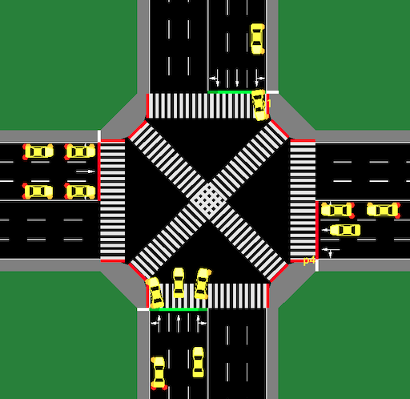
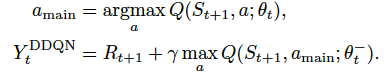

# Scramble Crossing in SUMO (SUMO環境での深層強化学習での信号の最適化_簡易ver_)
This repository is showing the method to optimise Traffic Signal Control in X Crosswalk with Deep Reinforcement Learning. 

Installation instructions
-------------------------
The tested installation environment is Ubuntu(ver =< 20.04). 
As a premise, to implement this simulation, instration of SUMO(Simulaton of Urban Mobility) is eccentially required following below: 
SUMO INSTRATION HERE: <https://www.eclipse.org/sumo/>. 
After getting the instration done, run the commands in your terminal 

    export SUMO_HOME=/usr/share/sumo
    
    cd $SUMO_HOME
    
Then you are now able to see the SUMO system in your machine. 

CUDA Settings
-------------------------
My CUDA version is 11.0. So to the best of my knowledge, TensorFlow2.4+CUDA==11.0 is reckoned as the best couple. 
In terms of the optimal combination between NVIDIA cuDNN and python packages, you can dive deep into the following web site <https://pytorch.org/get-started/previous-versions/>.  
After completion of setting CUDA properly, I would recommend you to run this command firstly,

    conda install pytorch==1.7.1 torchvision==0.8.2 torchaudio==0.7.2 cudatoolkit=11.0 -c pytorch

Next My Python environment version is python == 3.7.11 which works well on my machine(you might be able to change the version but it does noeed to be corresponding to your CUDA Version) 
To install all of the above, it should be enough to run 

    pip install -r requirements.txt

from the base directory of the package. 

Main Analysis
-------------------------
To see if what kind of intersection you will work with is

  

The method I use to optimise the TSC is straightforwardlly Double Deep Q-Network

  

(details: <https://arxiv.org/pdf/1509.06461.pdf>)

To run main file you can simply run

    python main.py

After traning this model, you can see the output result in models. like below:

  

  

Thank you.

